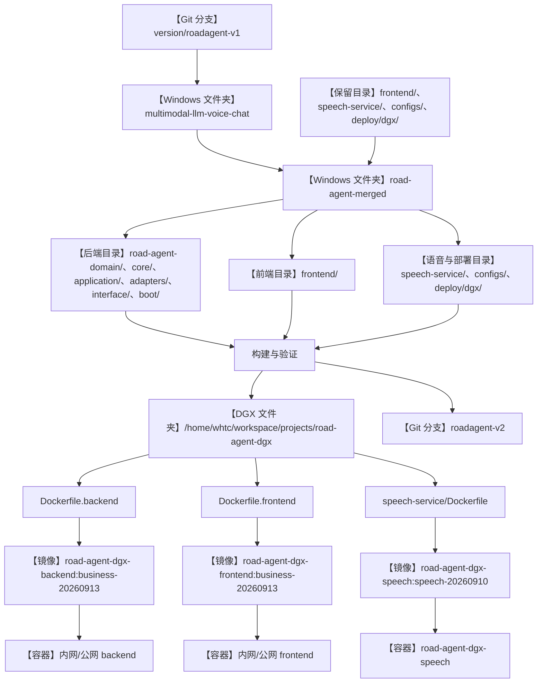
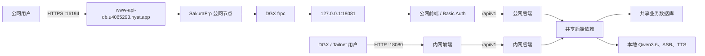

# RoadAgent 当前同步与访问架构

更新日期：2026-09-14。

## 业务代码同步与发布

可编辑 Mermaid 源文件：`docs/diagrams/current-sync-flow.mmd`。

PNG 文件：`docs/diagrams/current-sync-flow.png`。

## 名称、类型与实际位置

| 图中名称 | 类型 | 实际目录或定义文件 |
|---|---|---|
| 上游业务仓库 | Windows 文件夹 | `C:\Users\ruixuanhu\Desktop\S534_DXG\multimodal-llm-voice-chat` |
| 实际合并工作区 | Windows 文件夹 | `C:\Users\ruixuanhu\Desktop\S534_DXG\road-agent-merged` |
| DGX 主项目 | DGX 文件夹 | `/home/whtc/workspace/projects/road-agent-dgx` |
| 后端源码 | 项目内目录 | `road-agent-domain/`、`road-agent-core/`、`road-agent-application/`、`road-agent-adapters/`、`road-agent-interface/`、`road-agent-boot/` |
| 前端及数字人 | 项目内目录 | `frontend/src/`、`frontend/public/`、`frontend/digital-human-demo.html` |
| ASR/TTS 服务 | 项目内目录 | `speech-service/` |
| 模型与部署配置 | 项目内文件/目录 | `configs/models.yaml`、`deploy/dgx/` |
| 后端镜像 | Docker 镜像 | 由 `deploy/dgx/Dockerfile.backend` 构建；Java 产物来自 `road-agent-boot/target/*.jar` |
| 前端镜像 | Docker 镜像 | 由 `deploy/dgx/Dockerfile.frontend` 构建；输入 `frontend/`，静态产物为 `frontend/dist/` |
| 语音镜像 | Docker 镜像 | 由 `speech-service/Dockerfile` 构建 |
| 内外网容器 | Docker 运行实例 | 由 `deploy/dgx/compose.yaml` 和 `deploy/dgx/compose.public.yaml` 定义 |
| Qwen 模型服务 | 独立 DGX 项目 | `/home/whtc/workspace/projects/model-serving`；权重位于 `/home/whtc/models/NVIDIA--Qwen3.6-35B-A3B--NVFP4` |
| ASR/TTS 权重 | DGX 模型目录 | `/home/whtc/models/Systran--faster-whisper-small`、`/home/whtc/models/Qwen--Qwen3-TTS-12Hz-0.6B-CustomVoice` |
| `business-20260913` | Docker 镜像标签 | 不是目录，也不是单独项目 |
| `public-backend`、`public-frontend` | Compose 服务名 | 不是目录；对应公网容器 |
| `roadagent-business`、`roadagent-public` | 当前部署中不是源码根目录 | 当前唯一源码根目录是 `/home/whtc/workspace/projects/road-agent-dgx` |
| `road_agent` | MySQL schema | 外部数据库，不是项目目录；连接来自 `deploy/dgx/.env` 和公网凭据文件 |

## 当前公网与内网访问

当前公网主界面：<https://www-api-db.u4065293.nyat.app:16194/>。

当前公网数字人演示：<https://www-api-db.u4065293.nyat.app:16194/digital-human-demo.html>。

可编辑 Mermaid 源文件：`docs/diagrams/current-public-access-flow.mmd`。

PNG 文件：`docs/diagrams/current-public-access-flow.png`。
