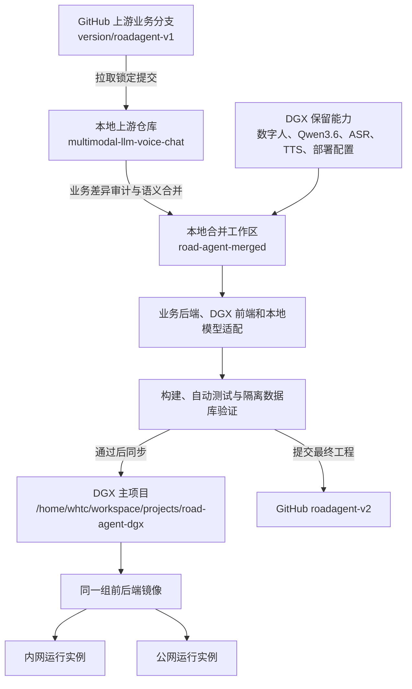
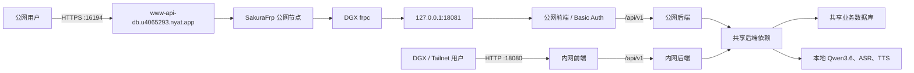

# RoadAgent 当前同步与访问架构

更新日期：2026-09-14。

## 业务代码同步与发布

可编辑 Mermaid 源文件：`docs/diagrams/current-sync-flow.mmd`。

PNG 文件：`docs/diagrams/current-sync-flow.png`。

## 当前公网与内网访问

当前公网主界面：<https://www-api-db.u4065293.nyat.app:16194/>。

当前公网数字人演示：<https://www-api-db.u4065293.nyat.app:16194/digital-human-demo.html>。

可编辑 Mermaid 源文件：`docs/diagrams/current-public-access-flow.mmd`。

PNG 文件：`docs/diagrams/current-public-access-flow.png`。
