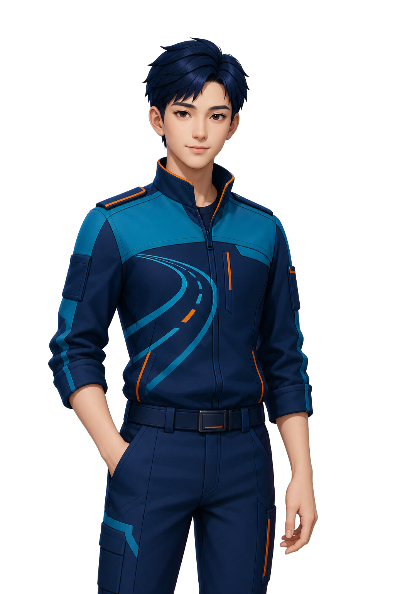

# 福建应急交通 Agent“路智通”数字人形象与轻量动态设计方案

**文档版本：** V1.0（方案版）  
**编制日期：** 2026-08-22  
**主要受众：** 交通应急值班、路况研判、调度审核及产品研发团队  
**当前阶段：** 设计评审；不生成候选图片，不调整前端代码

> **方案结论**
>
> 三类产品能力继续共用同一个“路智通”数字人 IP。本阶段先用三种差异明确的美术方向验证专业可信度、界面适配性与品牌辨识度；团队评审并选定一套方向后，再扩展待命、思考、讲解及局部口型素材。动态路线采用“透明分层位图 + 语义状态机 + CSS/Web Animations + 可选音量驱动嘴型”，不在本阶段引入 Live2D、3D 或精确音素口型。

---

## 1. 项目理解与设计前提

### 1.1 三条已打通的产品闭环

项目不是开放域聊天机器人，而是受业务规则约束的福建应急交通助手。目前已经打通三条纵向闭环：

1. **交通问答：** 自然语言输入，经意图识别、交通 Skill 和高德 Tool 获取事实，最终由 Java 生成确定性回答。
2. **应急调度：** MySQL 异常事件进入顶部告警卡，由模型生成版本化调度建议，经人工批准或驳回后留痕。
3. **语音交互：** 浏览器录音经 Java 接口送入 Docker 内的 faster-whisper；回答摘要经 Edge-TTS 分段合成后在浏览器播放。

这三条能力在体验上可以由同一人物承接，但其表达必须始终服从产品的信任边界：交通事实不能被模型自由改写；正式调度不能绕过数据库事件和人工审批；语音或动画失败不能影响文字问答和业务处置。[S1][S2]

### 1.2 “路智通”的角色职责

“路智通”应被定义为**专业、冷静、克制的交通业务助手**，而不是具有最终处置权的虚拟领导者。其职责是：

- 解释实时道路或区域交通事实；
- 呈现 Agent 当前工作状态；
- 辅助值班人员理解模型建议和系统结果；
- 在正式调度流程中提示“建议、待审批、已驳回、已批准”等边界；
- 对失败、覆盖不足、语音不可用等情况给出诚实反馈。

其形象、动作和文案不得暗示系统已经掌握真实救援库存、实际到达时间、联系人、地图指挥或外部工单下发能力。统一资源库、知识库、地图可视化和外部工单平台仍属于未接入能力。[S1][S3]

### 1.3 主要用户与体验语气

本方案以内部交通值班、研判和调度审核人员为主要用户。数字人应传递：

- **可信而不压迫：** 有专业判断感，但不使用执法姿态或命令式手势；
- **清晰而不夸张：** 动作幅度小，避免娱乐主播式表演；
- **亲和而不幼态：** 可以微笑，但不能卡通化、偶像化；
- **智能而可问责：** 通过状态和话术表达“正在查询、正在生成建议、等待人工确认”，不伪装成无所不能。

---

## 2. 现有数字人资产与界面风格审计

### 2.1 现有资产



*图 1　当前前端唯一数字人源资产；黑色不属于图片背景，源文件实际为透明底。*

| 指标 | 核验结果 |
|---|---|
| 源文件 | `frontend/public/emergency-agent-avatar.png` |
| 文件大小 | 1,020,225 bytes |
| 画布 | 1024 × 1536 px，2:3 |
| 像素格式 | 32-bit RGBA PNG |
| Alpha 有效内容框 | 700 × 1440 px；左 125、右 199、上 96、下 0 px |
| 非透明内容覆盖率 | 约 40.41% |
| 构图特征 | 有效内容中心比画布中心左偏约 37 px，人物下缘贴底 |
| 角色数量 | 源资产仅一套；`dist` 中同名文件是构建复制件 |

现有角色为年轻东亚男性，采用精致半写实 3D / 游戏角色渲染。人物神态平静、轻微微笑，深蓝短发，身穿藏青、交通蓝、亮青拼接的高领作业服，橙色滚边用于警示点缀。胸前弧形道路和虚线车道纹样是最突出的交通 IP 识别符号。

### 2.2 现有界面视觉语言

人物区域采用深海军蓝至青绿色径向渐变，并叠加网格、轨道和薄荷青光效。橙色用于聆听和活跃提示，红色或紫红色用于告警与异常。整体风格可以概括为：

- 深蓝与青绿建立专业、可信、科技的底色；
- 少量橙色提供交通警示和活力；
- 玻璃拟态、圆角面板和柔和光晕降低严肃系统的压迫感；
- 网格与轨道表达数据处理，但不模拟真实地图或指挥中心；
- 大屏以三分之四身人物为主，小屏压缩为 112×112 或 86×92 的角色容器。

因此，新形象可以全面重构性别、年龄与画风，但需要继续适配深蓝—青绿—橙色界面体系，并在极小移动端容器中保持清晰轮廓。

### 2.3 当前动态方式

当前组件只支持 `idle | listening | speaking | error` 四种状态，且始终显示同一张闭口 PNG：

- **idle：** 整张人物图以 4.4 秒周期做轻微上下移动和缩放；
- **listening：** 人物不变，仅将外部轨道加速并变为橙色；
- **speaking：** 人物嘴部仍闭合，仅显示四柱 CSS 声波并增强光晕；
- **error：** 人物不变，仅切换背景色；
- **Agent 运行：** 当前被归为 listening，没有独立 thinking；
- **消息等待：** 思考反馈只存在于聊天气泡的三个跳点。

当前 TTS 链路只向前端返回 MP3 二进制，没有 duration、word boundary、phoneme 或 viseme 时间轴。因此，在不修改协议的前提下可以实现播放状态或音量驱动的近似开口，但不能承诺精确音素级唇同步。[S4][S5][S7]

### 2.4 现状问题与机会

1. **状态语义不准确：** 推理、工具调用和答案生成均被显示为“聆听”。
2. **人物没有真正动作：** 呼吸、声波和背景变化都发生在角色外部或整图层面。
3. **错误状态容易粘滞：** 当前根据最后一条失败消息判断 error，可能遮住新的录音行为。
4. **ASR 转写缺少反馈：** 录音结束后组件才进入转写，但对外仅暴露 recording 布尔值。
5. **移动端辨识不足：** 将三分之四身整图压缩到 86×92 px 后，嘴型和眼神几乎不可见。
6. **缺少可扩展资产规范：** 现有图没有统一姿态锚点、面部图层和移动端裁切。

---

## 3. 统一 IP 设计原则

### 3.1 保留与重构

| 维度 | 决策 |
|---|---|
| 名称 | 保留“路智通” |
| 业务关系 | 交通问答、应急调度、语音交互共用同一人物 |
| 人物外观 | 可全面重构性别、年龄、脸型、发型和美术风格 |
| 核心视觉 DNA | 深蓝、交通蓝、青绿、少量橙色；抽象道路/车道线 |
| 地域表达 | 低强度福建山海、海岸、航线或路网暗纹 |
| 身份表达 | 交通科技作业人员/数字助手，不模拟警务或执法人员 |
| 动态策略 | 先选形象，后扩展三身体姿态和局部面部层 |

### 3.2 共同约束

三套候选必须共同满足：

- 不出现警徽、肩章、国家机关徽记、真实部门名称或执法编号；
- 不使用高饱和红色作为日常服装主色；
- 不持有武器、指挥棒、警用装备或夸张全息地图；
- 不出现真实人物相貌、品牌 Logo、文字、水印和烘焙背景；
- 人物正面或轻微三分之四侧，目光稳定，表情克制；
- 画布、镜头、光向、人物比例和透明边距可进行横向比较；
- 服装和道具不能暗示项目尚未具备的地图指挥、库存调拨或工单下发能力。

---

## 4. 三套候选 IP 方向

### 4.1 横向定位

| 方向 | 核心验证问题 | 人物设定 | 美术风格 | 主要优势 | 主要风险 |
|---|---|---|---|---|---|
| A 城市交通值守官 | 专业可信是否足以承担值班与审批场景 | 约 35 岁女性 | 半写实 3D | 最贴合现有界面，面部和口型扩展自然 | 容易接近常见政务数字人 |
| B 道路数据研判师 | 小尺寸清晰度与经验感能否同时成立 | 约 40 岁男性 | 高级二维插画 | 轮廓明确、派生姿态稳定、移动端清晰 | 处理不当会显得动漫或宣传画化 |
| C 福建山海智行者 | 地域记忆点能否克制地融入专业系统 | 25–32 岁中性青年 | 现代新中式 2.5D | 品牌辨识高，福建关联自然 | 地域符号过强会旅游化或概念化 |

### 4.2 方向 A：城市交通值守官

**角色关键词：** 沉着、可靠、敏捷、有人情味。  
**人物建议：** 约 32–38 岁东亚女性，利落短发或束发，面部轮廓成熟但不过度严厉。  
**服装建议：** 深海军蓝交通科技作业夹克，青绿色结构拼片，胸前以一条连续弧形道路纹样作为识别符号，橙色仅用于拉链、缝线或小面积状态条。  
**待命姿态：** 身体正向，肩部放松，双手自然置于身体前侧或一手轻扶工作终端边缘；不抱臂、不叉腰。  
**动态适配：** 半写实面部结构适合制作眨眼和三档嘴型；讲解时可用小幅开放手势；思考时轻微侧目或抬手触碰下颌。

**提示词蓝图（暂不执行）：**

> 一位约35岁的东亚女性交通业务数字助手，沉着、专业、可信，精致半写实3D角色渲染，利落深色短发，克制友善的微笑，深海军蓝与交通蓝拼接的现代交通科技作业服，青绿色结构线，少量橙色滚边，胸前含抽象弧形道路与虚线车道纹样，无真实部门标识，无警徽，正面三分之四身待命姿态，手势自然，柔和棚拍光，轮廓清晰，透明背景，1024×1536，2:3。

**修正重点：**

- 降低美容广告感和偶像感；
- 避免高跟鞋、礼服化收腰和不适合值班工作的装饰；
- 通过发型轮廓、道路纹样和领口结构建立独特性，而不是增加徽章。

### 4.3 方向 B：道路数据研判师

**角色关键词：** 理性、经验、清晰、克制。  
**人物建议：** 约 38–45 岁东亚男性，短发，可有极轻的年龄纹理，不使用浓重胡须或“领导式”威严表情。  
**服装建议：** 现代工作夹克或轻型技术马甲，深蓝大色块配青绿色几何分面，橙色用于细线和道路节点；避免传统西装领带。  
**画面风格：** 高级二维赛璐璐与编辑插画之间的表现，边缘干净、明暗分区明确，面部不幼态。  
**待命姿态：** 身体轻微转向但目光看向用户，双手自然放松；可以有一只手轻托无文字的数据卡片，但首轮母版建议不带道具。  
**动态适配：** 明确的线条和色块适合切换嘴型、眉眼和手势；在 86×92 px 容器中比细腻写实材质更易识别。

**提示词蓝图（暂不执行）：**

> 一位约40岁的东亚男性道路数据研判数字助手，理性、经验型、沉稳但不威严，高级二维数字插画与克制赛璐璐风，干净有力的轮廓，成熟自然的面部比例，深蓝技术工作夹克，青绿色几何拼片，少量橙色道路节点和虚线纹样，不穿西装，不使用警务制服，无徽章，无文字，正面三分之四身待命姿态，清晰色块与柔和体积光，透明背景，1024×1536，2:3。

**修正重点：**

- 禁止大眼、尖下巴、夸张发色等青少年动漫特征；
- 用少量面部纹理和稳重色块表达经验，不用严厉皱眉；
- 线条需要在缩小后仍清晰，避免过密纹样。

### 4.4 方向 C：福建山海智行者

**角色关键词：** 山海、连接、守望、现代东方。  
**人物建议：** 25–32 岁中性气质东亚青年，五官柔和但轮廓明确，性别表达不过度符号化。  
**服装建议：** 现代新中式结构与交通作业服融合，不使用传统长袍；通过领口层叠、海岸曲线、山脊层次和抽象航线表达福建。  
**画面风格：** 现代新中式 2.5D 数字插画，兼具平面构成和轻体积材质；避免水墨古风、文旅海报或仙侠感。  
**色彩建议：** 深海军蓝为底，青绿色表达山海层次，暖橙色表达交通节点；可加入极少量瓷白作为呼吸空间。  
**动态适配：** 山海曲线可作为轻微流动的服装暗纹或界面叠层；人物本体动作仍保持克制，避免依赖复杂粒子。

**提示词蓝图（暂不执行）：**

> 一位25至32岁的东亚中性青年交通数字助手，现代、冷静、亲和，现代新中式2.5D数字插画，深海军蓝现代交通科技作业服，青绿色海岸线与山脊层次暗纹，少量橙色航线节点，结构简洁，不是传统服饰，不是旅游宣传，不出现土楼、灯笼或古风配饰，无警徽，无文字，正面三分之四身待命姿态，现代东方审美，柔和体积光与清晰轮廓，透明背景，1024×1536，2:3。

**修正重点：**

- 福建表达只做抽象纹样，不直接堆叠土楼、海浪、茶叶等符号；
- 保持“内部业务助手”而非文化吉祥物；
- 控制半透明和发光材质，确保透明底边缘干净。

### 4.5 通用禁止项

三套提示词均追加以下禁止项：

> 不要警察、交警、军装、肩章、警徽、臂章、政府徽记、品牌Logo、文字、水印、背景场景、地图大屏、武器、指挥棒、头盔遮脸、夸张英雄姿态、抱臂训话、卡通幼态、大眼动漫、偶像妆容、旅游海报、传统戏服、高饱和红色、裁断头部或手部、多余手指、黑边白边、低清晰度。

---

## 5. 生成、评审与迭代流程

### 5.1 阶段划分

1. **方案门：** 团队评审本报告，确认三方向和共同约束。
2. **母版轮：** 每个方向只生成一张标准待命母版，不生成动作包。
3. **校准轮：** 对构图、年龄、服装、地域表达和专业度进行反馈；必要时多轮修改。
4. **选择门：** 团队结合评分、讨论和使用场景确定一个方向，评分不自动替代集体判断。
5. **资产轮：** 以选定母版为唯一身份参考，扩展思考、讲解和局部表情层。
6. **实现门：** 资产通过一致性验收后，才开始状态机和前端集成。

### 5.2 第一轮母版统一规格

- 1024×1536 px、2:3、RGBA、sRGB、透明背景；
- 正面或轻微三分之四视角，三分之四身构图；
- 人物头顶、眼线、肩线、中心轴和底部基线采用统一参考线；
- 同一柔和主光方向，不烘焙环境背景、文字、光环和界面；
- 人物占画布高度约 88%–94%，面部在移动端裁切后仍可辨认；
- 手部完整、轮廓不贴边，服装道路纹样在缩小时仍能识别；
- 三张图使用一致的展示底板进行评审，避免背景差异干扰判断。

### 5.3 建议评分表

| 维度 | 权重 | 评审问题 |
|---|---:|---|
| 专业可信与角色匹配 | 30% | 是否像可靠的交通值班与研判助手，而非娱乐主播或执法人员？ |
| 小尺寸识别 | 20% | 在 112×112 与 86×92 场景中，脸部、发型和轮廓是否仍可识别？ |
| 现有界面适配 | 15% | 是否与深蓝—青绿—橙色人物区、告警卡和聊天面板协调？ |
| 动态扩展能力 | 15% | 是否容易保持身份一致地制作思考、讲解、眨眼和嘴型？ |
| 品牌辨识 | 10% | 去掉名称后，轮廓、服装和道路纹样是否仍有记忆点？ |
| 地域表达克制度 | 10% | 福建元素是否自然、现代且不旅游化？ |

评分建议采用 1–5 分制，记录每位评审者的理由。最终结论以团队综合反馈为准；如果三套均未通过硬性门槛，则继续修改，不强行选出最高分方案。

### 5.4 硬性门槛

- 不会被误认为真实警务、交通执法或政府人员；
- 不暗示已经具备真实库存、地图调度、联系人或工单下发能力；
- 正常桌面尺寸与移动端头像裁切均可识别；
- 透明边缘无黑边、白边和背景残留；
- 后续姿态能保持同一脸型、年龄、发型、服装版型和光向；
- 无真实人物肖像、第三方品牌、文字水印和来源不明的版权元素。

### 5.5 一致性控制

选定母版后，所有派生动作必须采用参考图编辑或受控重绘，不从纯文本重新随机生成。制作过程需要：

- 锁定脸型、五官比例、肤色、瞳色、发型轮廓和年龄感；
- 锁定制服版型、道路纹样、色值、材质和缝线位置；
- 建立头顶、眼线、肩线、人物中心与底部基线五组锚点；
- 说话只改变嘴部、眉眼和有限讲解手势；
- 思考只改变视线、头部小角度和一处手势；
- 每轮先叠加对齐检查，再评价美术效果；
- 不允许各姿态单独自动裁切或重新居中。

---

## 6. 选定 IP 后的动作资产包

### 6.1 资产构成

| 资产 | 用途 | 制作方式 |
|---|---|---|
| `body-idle` | 在线待命、聆听基础 | 完整透明身体母版 |
| `body-thinking` | ASR转写、Agent推理、Tool调用、调度生成 | 同一人物的思考姿态 |
| `body-explaining` | 文字回答与语音讲解 | 同一人物的小幅开放手势 |
| `eyes-open` | 默认眼部 | 局部透明层 |
| `eyes-blink` | 低频眨眼 | 与眼部严格配准的局部层 |
| `mouth-closed` | 待命、思考、无声回答 | 局部透明层 |
| `mouth-mid` | 中等音量 | 局部透明层 |
| `mouth-open` | 较高音量 | 局部透明层 |
| `portrait-mobile` | 112×112、86×92 场景 | 从同一高分辨率母版导出的头肩裁切 |

### 6.2 文件与锚点规范

- 归档母版：1024×1536 RGBA PNG，保留透明抗锯齿和完整图层源文件；
- Web 运行资产：透明 WebP 为主，PNG 回退；最终压缩参数在视觉验收后确定；
- 移动端头像：建议 512×512 头肩裁切，不重新生成另一张脸；
- 身体姿态先保留同画布坐标；局部层可在实现阶段裁成最小包围盒，并配套坐标清单；
- 所有文件使用小写英文和短横线命名，避免业务名称进入文件名；
- 背景网格、轨道、状态色和声波属于 UI，不烘焙进人物图片。

---

## 7. 后续轻量动态技术架构

> 本章为工程评审蓝图，不代表本阶段将修改代码。

### 7.1 推荐数据流

```text
ASR录音/转写   Agent阶段/工具   前台交通查询/应急操作   TTS播放
       \             |                  |               /
        \            |                  |              /
             DigitalHumanOrchestrator
        （状态仲裁、短暂错误、强度与可访问文案）
                         |
          DigitalHumanSignal { mode, intensity, statusLabel }
                         |
              LayeredDigitalHumanRenderer
        （身体姿态、眼睛、嘴型、声波、静态降级）
```

数字人组件不直接依赖交通、应急或语音 Store 的业务细节。各模块只上报语义活动，由统一仲裁层输出可渲染状态。

### 7.2 建议接口

```ts
type DigitalHumanMode =
  | 'idle'
  | 'listening'
  | 'thinking'
  | 'answering'
  | 'speaking'
  | 'error'

interface DigitalHumanSignal {
  mode: DigitalHumanMode
  intensity: number       // 0..1；主要用于近似嘴型
  statusLabel: string     // 同步提供可见文案与无障碍文本
}
```

`answering` 与 `speaking` 共用讲解身体姿态：文字流式输出时嘴部保持闭合或仅做自然表情，只有浏览器中的音频实际成功播放后才进入 speaking 并驱动嘴型。

### 7.3 状态映射

| 模式 | 触发来源 | 视觉表现 |
|---|---|---|
| idle | 无前台活动 | 待命身体、低频眨眼、轻呼吸 |
| listening | 麦克风正在录音 | 待命身体轻微前倾、目光聚焦、橙色监听提示 |
| thinking | ASR转写、Agent连接/推理/Tool、用户触发的查询或调度生成、TTS加载 | 思考身体、缓慢提示光效，嘴部闭合 |
| answering | `answer.delta` 正在输出但未播放语音 | 讲解身体、嘴部闭合、轻微点头 |
| speaking | `audio.play()` 成功且播放状态为 playing | 讲解身体、三档嘴型、声波 |
| error | 前台任务刚失败且无更高优先级活动 | 短暂收敛表情与错误色，约3秒后恢复 |

推荐仲裁优先级为：用户主动录音 → 实际音频播放 → 前台思考/回答 → 短暂错误 → 待命。后台五秒告警轮询不参与状态机，避免人物周期性进入思考。

### 7.4 音量驱动近似嘴型

浏览器 Web Audio API 的 `AnalyserNode` 可以提供实时的时域或频域分析数据，适合从正在播放的音频计算平滑后的归一化振幅。[W1]

后续可在音频播放服务内部建立：

```text
HTMLAudioElement
      ↓
MediaElementAudioSourceNode
      ↓
AnalyserNode ──→ 0..1 振幅 ──→ 闭口 / 半开 / 全开
      ↓
AudioDestinationNode
```

这是一种“说话节奏近似”，不是音素口型。准确唇同步必须新增 speech marks、phoneme 或 viseme 时间轴，并扩展 Python、Java 与前端接口；不属于本阶段。

### 7.5 降级顺序

1. Web Audio 可用：使用振幅驱动三档嘴型；
2. AudioContext 被挂起或不可用：playing 时使用固定嘴型循环；
3. 局部嘴型素材失败：退化为讲解姿态、声波和呼吸；
4. TTS失败或自动播放被拒绝：不进入 speaking，文字回答保持正常；
5. `prefers-reduced-motion: reduce`：关闭循环位移、频繁眨眼和高频嘴型，只保留静态姿态与低频状态提示；该偏好由 Media Queries 标准定义。[W2]
6. 移动端：优先显示头肩裁切、声波和状态色，嘴型不作为唯一反馈。

### 7.6 暂不采用的路线

| 路线 | 暂缓原因 | 未来触发条件 |
|---|---|---|
| Rive | 需要重新拆层和绑定，增加 Web 运行时与设计工具流程 | 需要更复杂交互且团队具备持续动效制作能力 |
| Live2D | 需要分层 PSD、专业绑定和许可评估 | 需要更自然的脸部参数、视线和表情控制 |
| 3D VRM/glTF | 会明显改变视觉风格，并增加 WebGL、性能和模型制作成本 | 产品转为沉浸式指挥大屏或多视角数字人 |
| 精确 viseme | 当前 TTS 无时间轴，需改造端到端协议 | 明确要求播报级精确唇同步并接受后端改造 |

Rive Web 运行时支持由状态机驱动 Web 动画；Live2D Cubism SDK for Web 可控制模型参数，并提供基于音量的唇同步方式。两者均具有更高的资产制作和运行时成本，因此仅作为后续升级选项。[W3][W4]

---

## 8. 实施边界与后续工作

### 8.1 本阶段包含

- 项目与现有角色资产审计；
- 三套候选方向、人设、服装、提示词蓝图和禁止项；
- 统一母版与后续动作资产规范；
- 团队评审方法与硬性门槛；
- 工程可评审级轻量动态架构；
- Markdown 与 Word 方案报告。

### 8.2 本阶段不包含

- 不生成三张候选母版或任何新角色图片；
- 不修改 `DigitalHumanPanel.vue`、`App.vue`、Pinia Store 或语音服务；
- 不安装前端依赖，不引入 Rive、Live2D、Lottie 或 Three.js；
- 不调整 TTS HTTP 协议，不实现 speech marks 或 viseme；
- 不重做聊天区、应急告警卡或整体 UI；
- 不代替团队自动决定最终 IP。

### 8.3 选图后的归档版

候选图完成、团队评审并确定最终方向后，报告更新为归档版，新增：

- 三张候选母版及迭代版本；
- 团队评分、意见摘要和决策记录；
- 最终角色正稿、人物设定和色彩规范；
- 完整动作与局部图层资产清单；
- 运行资产体积、移动端裁切和命名表；
- 前端实现任务、测试范围和验收结果。

---

## 9. 风险与控制

| 风险 | 影响 | 控制措施 |
|---|---|---|
| 生成式人物在不同姿态中漂移 | 用户认为是不同角色 | 选定单一母版后采用参考编辑；锚点叠加检查 |
| 形象近似警务或执法人员 | 身份误导与合规风险 | 禁用徽章、肩章、制式警服和命令式动作 |
| 半写实风格产生“恐怖谷” | 降低信任和亲和度 | 控制皮肤纹理与微笑幅度；优先自然眼神 |
| 福建元素旅游化 | 偏离内部业务产品 | 仅用抽象山海、海岸和路网暗纹 |
| 移动端看不清嘴型 | 状态反馈失效 | 独立头肩裁切；声波、文字和状态色并用 |
| 多张全尺寸位图占用内存 | 页面加载或切换卡顿 | 身体姿态数量受控；局部层裁切；WebP运行资产 |
| AudioContext受浏览器策略限制 | 无法音量驱动 | 固定循环与静态声波降级 |
| 动作暗示系统正在执行真实调度 | 用户误解能力边界 | 状态文案使用“建议、查询、待审批”，避免“已派发” |
| 使用真实人物或受保护标识 | 肖像与版权风险 | 不使用真人参考、第三方Logo和真实部门标识；上线前做权利核验 |

---

## 10. 验收标准

### 10.1 方案报告

- Markdown 与 Word 的章节、结论、评分标准和技术边界一致；
- 当前能力、未实现能力和审批边界与仓库事实一致；
- 三套方向差异明确，且都服务于同一“路智通”身份；
- 提示词和禁止项可以直接用于后续母版生成评审；
- Word 中的中文字体、图片、表格、页眉页脚与分页无明显缺陷；
- 本方案版不包含伪造的候选图、不修改产品代码。

### 10.2 后续母版

- 三张图均满足统一画布、构图、光向和透明背景要求；
- 每张图通过身份、能力、移动端和透明边缘硬性门槛；
- 团队可以基于同一评分表进行比较；
- 若均不满意，允许继续修改而不是强制选择。

### 10.3 后续动作包

- 待命、思考和讲解姿态被识别为同一人物；
- 嘴型和眼部局部层严格对齐，无明显跳位；
- 移动端头像与桌面母版来自同一角色；
- 动态失败、TTS失败和减少动态偏好均有静态降级；
- 三类产品能力不切换人物，只切换状态与界面上下文。

---

## 11. 证据与来源

### 11.1 仓库事实

- **[S1]** `README.md:3-11, 273-310, 417-419`：三条闭环、模型/Java边界、交通/调度/语音能力及未实现项。
- **[S2]** `road-agent-core/src/main/java/cn/fj/roadagent/core/agent/IntentPlanner.java:35-79`：意图白名单、交通范围和 Java 参数校验。
- **[S3]** `docs/LEARNING_GUIDE.md:33, 51-54, 71-81`：失败不得伪造成功、资源/工单边界、数字人状态测试及分层规则。
- **[S4]** `frontend/src/components/DigitalHumanPanel.vue:2-24`、`frontend/src/App.vue:34-39`：当前数字人状态、固定图片和状态映射。
- **[S5]** `frontend/src/styles.css:79-183, 455-505`：人物区配色、呼吸、声波、响应式尺寸和减少动态支持。
- **[S6]** `frontend/src/stores/agent.ts:51-119`、`frontend/src/stores/speech.ts:76-176`：Agent事件与语音播放生命周期。
- **[S7]** `frontend/src/api/speechApi.ts:39-53`、`speech-service/app/engines.py:79-95`、`road-agent-interface/src/main/java/cn/fj/roadagent/interfaces/rest/speech/SpeechController.java:73-96`：当前TTS仅返回MP3音频，无时间轴。
- **[S8]** `frontend/public/emergency-agent-avatar.png`：当前唯一数字人源资产。

### 11.2 Web 标准与候选技术

- **[W1]** W3C，[Web Audio API 1.1](https://www.w3.org/TR/webaudio-1.1/)，AnalyserNode。
- **[W2]** W3C，[Media Queries Level 5](https://www.w3.org/TR/mediaqueries-5/)，prefers-reduced-motion。
- **[W3]** Rive，[State Machine Playback for Web](https://rive.app/docs/runtimes/web/state-machines)。
- **[W4]** Live2D，[Lip-sync](https://docs.live2d.com/en/cubism-sdk-manual/lipsync/)。
- **[W5]** Live2D，[SDK Release License](https://www.live2d.com/en/sdk/license/)。

---

## 12. 版本记录

| 版本 | 日期 | 状态 | 内容 |
|---|---|---|---|
| V1.0 | 2026-08-22 | 方案版 | 现状审计、三方向、生成评审、动作资产与未来技术架构 |
| V2.0 | 待候选图评审后 | 规划中 | 加入候选图、团队反馈、最终选择、资产清单与实现计划 |
